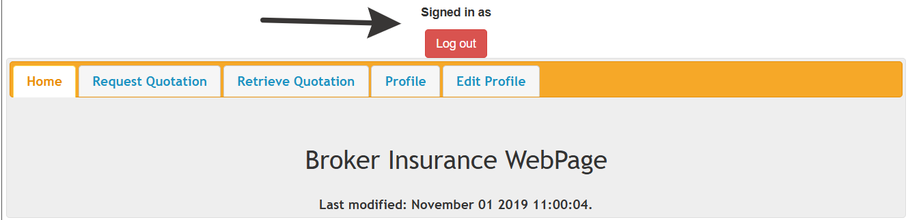

# Баг-репорт: Критическая уязвимость - вход в систему с пустыми полями

**ID:** BR-001
**Статус:** New
**Приоритет:** Critical
**Серьезность:** Critical
**Модуль:** Авторизация / Security

**Заголовок:** Возможность входа в систему без ввода учетных данных (пустые Email и Password)

**Окружение:**
- ОС: Windows 11 Pro
- Браузер: Яндекс Браузер 25.10.2.1176
- Устройство: Ноутбук Thunderrobot
- URL: https://demo.prv029.com/documented/24/index.php
- Дата/время обнаружения: 15.12.2025 19:36 (MSK)

**Шаги для воспроизведения:**
1. Перейти на страницу авторизации
2. Убедиться, что поля "Email" и "Password" пустые
3. Убедиться, что кнопка "Log in" активна (при наведении курсора меняется состояние)
4. Нажать кнопку "Log in"
5. Наблюдать результат

**Фактический результат:**
1. Кнопка "Log in" активна при пустых обязательных полях (см. скриншот 1)
2. Система выполняет вход без какой-либо проверки данных
3. Происходит перенаправление на домашнюю страницу "Home"
4. Отображается надпись "Signed in as" (без указания имени пользователя)
5. Пользователь получает полный доступ к системе без аутентификации
6. Навигационное меню доступно: Home, Request Quotation, Retrieve Quotation, Profile, Edit Profile
7. Кнопка "Log out" доступна для завершения сессии

**Ожидаемый результат:**
Согласно требованию #6:
- При пустых полях вход НЕ должен происходить
- Должно отображаться сообщение об ошибке: "Please enter your Email address and password correct"
- Поля для ввода email и пароля должны быть очищены после ошибки
- Пользователь должен остаться на странице логина
- Доступ к защищенным разделам должен быть запрещен

**Прикрепления:**
1. 
2. 

**Дополнительная информация:**
- **Критическая уязвимость безопасности уровня P0 (Блокирующая)**
- Нарушает базовые принципы аутентификации и авторизации
- Позволяет ЛЮБОМУ пользователю получить неавторизованный доступ к системе
- Создает риски для конфиденциальности данных других пользователей
- Противоречит требованию #1: "Должна быть возможность войти в систему" - подразумевается ВАЛИДНЫЙ вход
- Возможные причины:
  - Отсутствие валидации на клиентской стороне
  - Неправильная обработка пустых значений на сервере
  - Использование гостевой сессии по умолчанию вместо проверки аутентификации
- **Требуется НЕМЕДЛЕННОЕ исправление**

**Связанные тест-кейсы:**
- TC-LOGIN-004: Авторизация с пустыми полями
- TC-LOGIN-001: Успешная авторизация с валидными учетными данными (для сравнения поведения)
