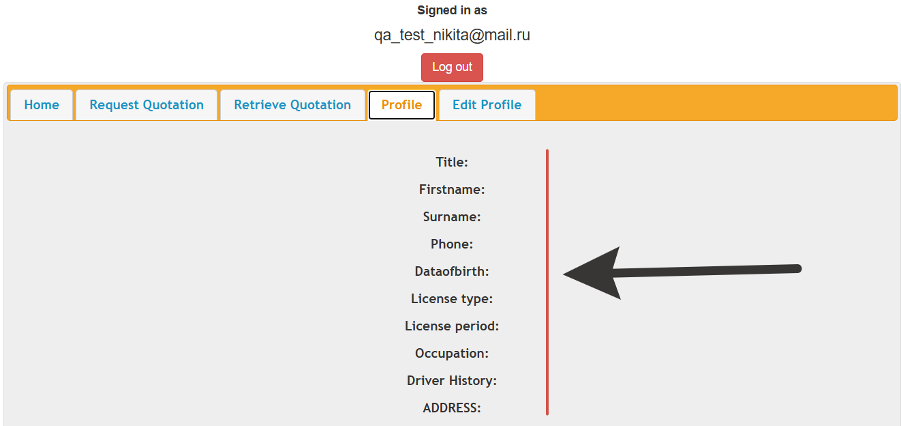

# Баг-репорт: Данные пользователя не сохраняются при регистрации

**ID:** BR-002
**Статус:** New
**Приоритет:** High
**Серьезность:** Major
**Модуль:** Регистрация / Профиль пользователя

**Заголовок:** Данные профиля отсутствуют на странице Profile после успешной регистрации

**Окружение:**
- ОС: Windows 11 Pro
- Браузер: Яндекс Браузер 25.10.2.1176
- Устройство: Ноутбук Thunderrobot
- URL: https://demo.prv029.com/documented/24/index.php → Profile
- Дата/время обнаружения: 15.12.2025 19:36 (MSK)

**Предусловия:**
1. Пользователь успешно зарегистрирован с заполнением ВСЕХ полей формы регистрации
2. При регистрации были указаны:
   - Title: Mr
   - First name: Nikita
   - Surname: Tester
   - Phone: +79161234567
   - Date of Birth: 1995-12-15
   - Licence type: Full
   - Licence period: 1 years
   - Occupation: Academic
   - Полный адрес (Street, City, County, Post code)

**Шаги для воспроизведения:**
1. Выполнить успешный вход в систему с учетными данными: qa_test_nikita@mail.ru (скриншот 3)
2. В навигационном меню нажать "Profile"
3. Проверить отображение данных пользователя на странице Profile

**Фактический результат:**
1. Успешный вход в аккаунт qa_test_nikita@mail.ru подтвержден (скриншот 3)
2. Страница Profile загружается корректно
3. ВСЕ поля профиля отображаются пустыми (скриншот 4):
   - Title: [пусто]
   - Firstname: [пусто]
   - Surname: [пусто]
   - Phone: [пусто]
   - Dataofbirth: [пусто]
   - License type: [пусто]
   - License period: [пусто]
   - Occupation: [пусто]
   - Driver History: [пусто]
   - ADDRESS: [пусто]
4. Данные, введенные при регистрации, полностью отсутствуют
5. Форма выглядит как новая, незаполненная форма регистрации

**Ожидаемый результат:**
- На странице Profile должны отображаться ВСЕ данные, введенные при регистрации
- Каждое поле должно содержать соответствующее значение:
  - Title: Mr
  - Firstname: Nikita
  - Surname: Tester
  - Phone: +79161234567
  - Dataofbirth: 1995-12-15
  - License type: Full
  - License period: 1 years
  - Occupation: Academic
  - ADDRESS: [полный адрес, введенный при регистрации]
- Данные должны сохраняться в базе данных
- При открытии профиля данные должны подтягиваться из БД и отображаться в режиме "только для чтения"

**Прикрепления:**
1. 
2. 

**Дополнительная информация:**
- **Системная проблема хранения пользовательских данных**
- Влияет на основную бизнес-функциональность приложения
- Пользователь не может просматривать свои регистрационные данные
- Возможные причины:
  - Данные НЕ сохраняются в БД при регистрации (только логин/пароль)
  - Данные сохраняются, но НЕ загружаются при открытии Profile
  - Неправильное связывание данных профиля с учетной записью
  - Ошибка в SQL-запросе при получении данных профиля
- Последствия:
  - Пользователь теряет доверие к системе
  - Невозможно проверить правильность введенных при регистрации данных
  - Потенциальная потеря важной информации пользователя
- **Требует срочного исправления перед релизом**

**Связанные тест-кейсы:**
- TC-REG-001: Успешная регистрация нового пользователя
- TC-LOGOUT-003: Проверка навигационного меню после входа
